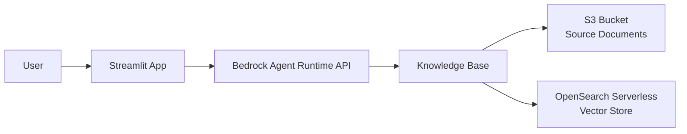

# Bedrock Doc Demo

> **A complete demo of building a document Q&A system using Amazon Bedrock Knowledge Bases**

This repository demonstrates how to build an AI-powered document question-answering system using:
- **Amazon Bedrock Knowledge Bases** for RAG (Retrieval Augmented Generation)
- **Streamlit** for the web-based chat interface
- **AWS CDK** for infrastructure deployment

Ask questions about your documents in natural language and get AI-generated answers based on the content!

## 📚 What's Included

This repository contains three main components:

1. **Streamlit App** (`app/`) - A chat interface to query your documents
2. **Infrastructure as Code** (`infra/cdk/`) - AWS CDK stack to deploy the Bedrock Knowledge Base
3. **Helper Scripts** (`scripts/`) - Scripts for easy deployment and running

## ✨ Features

- 💬 **Interactive chat interface** with Amazon Bedrock
- 📖 **Knowledge Base integration** using the `retrieve_and_generate` API
- ⚙️ **Flexible configuration** via sidebar, secrets file, or environment variables
- 💾 **Session management** for maintaining chat history
- 🔒 **Private networking** via VPC endpoints (optional but included in CDK stack)
- 📄 **Automatic document parsing** using Bedrock Data Automation

## 🏗️ Architecture

For a detailed explanation of the architecture, components, and workflow, see **[ARCHITECTURE.md](ARCHITECTURE.md)**.

**Quick Overview**:


## 🚀 Quick Start

### Prerequisites

- AWS account with Bedrock access
- AWS credentials configured (AWS CLI or environment variables)
- Node.js (for CDK deployment)
- Python 3.8+
- An existing **OpenSearch Serverless collection** (you must create this separately)

### Step 1: Deploy Infrastructure

Deploy the AWS infrastructure (VPC, S3, Knowledge Base):

```bash
./scripts/deploy_infra.sh
```

This creates:
- VPC with private subnets and VPC endpoints
- S3 bucket for document storage
- Bedrock Knowledge Base with S3 data source
- IAM roles and permissions

**Important**: Save the `KnowledgeBaseId` from the CDK outputs!

### Step 2: Upload Documents

Upload your documents to the S3 bucket under the `kb/` prefix:

```bash
# Get bucket name from CDK outputs
aws s3 cp your-document.pdf s3://<bucket-name>/kb/
```

Then sync the Knowledge Base to index the documents.

### Step 3: Setup and Run the Streamlit App

1. Create a virtual environment:
```bash
python -m venv app/venv
```

2. Activate it and install dependencies:
```bash
source app/venv/bin/activate  # On Windows: app\venv\Scripts\activate
pip install -r app/requirements.txt
```

3. Configure secrets (optional - can also use sidebar UI):
```bash
mkdir -p app/.streamlit
cp app/.streamlit/secrets.example app/.streamlit/secrets.toml
```

4. Edit `app/.streamlit/secrets.toml` with your actual values:
```toml
AWS_ACCESS_KEY_ID = "your-access-key-id"
AWS_SECRET_ACCESS_KEY = "your-secret-access-key"
AWS_SESSION_TOKEN = "" # optional
KNOWLEDGE_BASE_ID = "your-knowledge-base-id"
BEDROCK_MODEL_ARN = "arn:aws:bedrock:ap-southeast-2::foundation-model/anthropic.claude-3-haiku-20240307-v1:0"
```

5. Start the application:

```bash
./scripts/start.sh
```

Or manually:

```bash
cd app
source venv/bin/activate
streamlit run app.py
```

6. Open your browser to http://localhost:8501

7. Configure the app:
   - Enter AWS credentials in the sidebar
   - Enter the Knowledge Base ID (from Step 1)
   - Click "Update Configuration"
   - Start asking questions about your documents!

## ⚙️ Configuration Options

The app can be configured in multiple ways (in order of precedence):

1. **Sidebar UI** - Best for quick testing and experimentation
2. **Secrets file** (`app/.streamlit/secrets.toml`) - Best for local development
3. **Environment variables** - Best for production deployments

### Creating AWS Access Keys

If you need to create access keys:
1. AWS Console → IAM → Users → your user → Security credentials
2. Create access key → choose "Application running outside AWS"
3. Copy the Access Key ID and Secret Access Key

## 📖 How It Works

1. **User asks a question** in the Streamlit chat interface
2. **App sends the question** to Bedrock using the `retrieve_and_generate` API
3. **Bedrock retrieves relevant content** from your documents using vector search
4. **Claude 3 Haiku generates an answer** based on the retrieved context
5. **Answer is displayed** in the chat interface

## 🔧 Customization

### Change the AI Model

Update the model ARN in your configuration:

```toml
# Use Claude 3 Sonnet instead of Haiku
BEDROCK_MODEL_ARN = "arn:aws:bedrock:ap-southeast-2::foundation-model/anthropic.claude-3-sonnet-20240229-v1:0"
```

### Change the AWS Region

1. Update `infra/cdk/bin/app.ts` (line 11)
2. Update `app/app.py` (line 82)
3. Update model ARNs to match the new region

## 🛡️ Security & Networking

- **VPC with private subnets**: Infrastructure deployed in isolated network
- **VPC endpoints**: Private connectivity to AWS services (no internet required)
- **Encrypted S3 bucket**: Server-side encryption for documents
- **IAM roles**: Least-privilege access for all components

**Important**: Knowledge Bases are AWS-managed and don't run in your VPC. Private connectivity is via VPC endpoints.

## 📝 Important Notes

- Uses the `retrieve_and_generate` API for RAG (Retrieval Augmented Generation)
- Default region: `ap-southeast-2` (Sydney, Australia)
- Default model: Claude 3 Haiku (fast and cost-effective)
- Requires an existing OpenSearch Serverless collection
- Documents must be synced to Knowledge Base after upload

## 🐛 Troubleshooting

**"Knowledge Base not found"**
- Verify the Knowledge Base ID is correct
- Check IAM permissions for `bedrock-agent-runtime:RetrieveAndGenerate`

**"Access Denied" errors**
- Ensure IAM user/role has Bedrock permissions
- Check Knowledge Base execution role can access S3 and OpenSearch

**No relevant answers**
- Verify documents are uploaded to the `kb/` prefix in S3
- Trigger Knowledge Base sync after uploading documents
- Check OpenSearch collection is accessible by the Knowledge Base

## 💰 Cost Estimation

I deployed this, loaded a 40MB document and played with it whilst developing the UI. these were my costs:

Estimated AWS costs for running with a **40MB document** (Sydney region):

| Component | Cost | Notes |
|-----------|------|-------|
| **S3 Vectors** | ~$0.003/month | 40MB at $0.06/GB storage |
| **S3 Source Storage** | ~$0.001/month | 40MB at $0.024/GB |
| **Bedrock Embedding** | ~$0.25 one-time | ~2.5M tokens at $0.0001/1K tokens |
| **Claude 3 Haiku (per query)** | ~$0.001/query | ~1.5K tokens per query |
| **S3 Vectors Queries** | ~$0.0025/1K queries | $2.50 per million API calls |

**Monthly Totals** (assuming 1,000 queries/month):
- **Estimated**: ~$1-2/month (after initial embedding)

> [!TIP]
> Using S3 as a vector store is significantly cheaper than OpenSearch Serverless (~$174-350/month). S3 Vectors has no minimum compute costs - you only pay for storage and queries.

## 📚 Additional Resources

- [ARCHITECTURE.md](ARCHITECTURE.md) - Detailed architecture and component descriptions
- [AWS Bedrock Documentation](https://docs.aws.amazon.com/bedrock/)
- [Bedrock Knowledge Bases Guide](https://docs.aws.amazon.com/bedrock/latest/userguide/knowledge-base.html)
- [Streamlit Documentation](https://docs.streamlit.io/)

## 📄 License

See repository license file for details.
